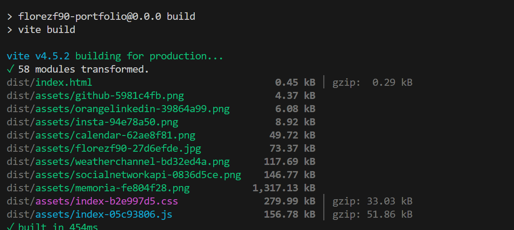
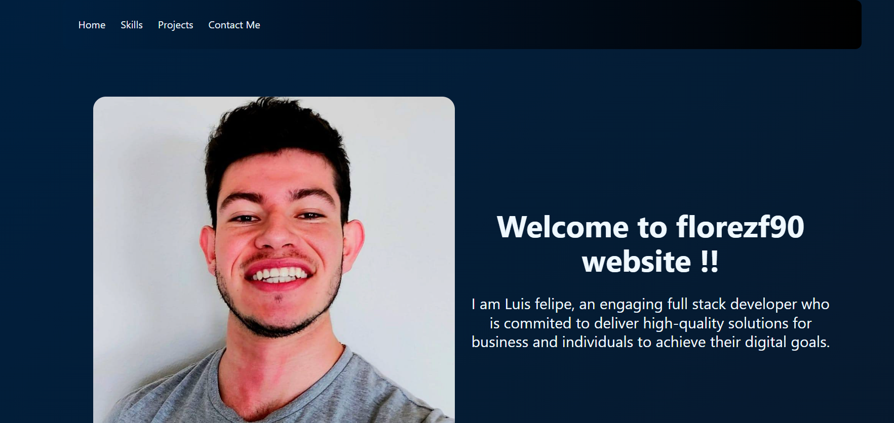

<h1 align= "center" id="title">florezf90 React Portfolio
</h1>

 

 

<h1>👩‍💻 About </h1>

The present project is a React personal portfolio created with the intention of implementing the new concepts learned in the Coding Bootcamp about this framework. To also leverage the use of React, we were encouraged to create a portfolio that will showcase all the skills learned so far, so we can show to the world what we are capable of. It is important to keep in mind that the current application is going to be on continous development, due to I'm just starting the learning curve with this key front end framework.

Even though I am fresh to the concepts of React, I ensured that the application will have minimum quality standards, such as:

* responsiveness, 

* performance, 

* simplicity 

* accessibility.

----------------------

  
 📊 Table of Contents 

  <ol>
    <li>
      <a href="#about">About The Project</a>
        <li><a  href="#built-with">Built With</a></li>
    </li>
    <li><a  href="#Installation">Installation</a></li>
    <li><a  href="#contributing">Contributing and Contact</a></li>
    <li><a  href="#ack">Acknowledgments</a></li>
    <li><a  href="#license" >License</a></li>
  </ol>

---------

<h1>💲Built With </h1>

* 

* 

* 

* 

* 

---------------------------------

<h1>🚀 Installation </h1>

💿 live demo link:  https://main--astonishing-cuchufli-821a63.netlify.app/

To use this app in a local envirioment, please follow these steps:

First, clone the  repository by following the next steps:

      git@github.com:florezf90/florezf90ReactPortfolio.git

2.Second, initialize the node packages by running:

        npm install

3.third, please build a new minified version by running:

     npm run build

      
Once done, your command line should look like this:

4.Launch the app on localhost by running:

     npm run dev

once done, you'll get something like this:

 

 -----------------------------

-------- 

 

<h1>📱 Contributing</h1>

    
If you have a suggestion that would make this project better, don't hesitate to reach out and create an issue with the tag "enhancement". Don't forget to give the project a star! Thanks again!

If you have any questions, reach to:

 ✉️ mail: florezf90@gmail.com 
 

----------------

  

<h1>🏆 Acknowledgments </h1>

*   

         Note: please refer to the 'Built it section' for more information about the docs on the technologies used in the project.   
  
-----

  

<h1>🔒🔑 License </h1>

 
 

## [🔝](#title)